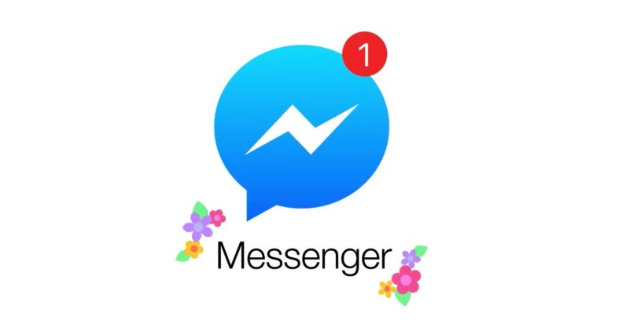

# Wit.ai Messenger Bot Tutorial Starter

A messenger bot that understands what cryptocurrency the user is asking the price about and then sends the price to the user. This is the tutorial starter.

## Video Example

A video of the code running

<a href="http://www.youtube.com/watch?feature=player_embedded&v=e3wnCErhFBU" target="_blank"><p align="center"></p></a>

## Getting Started

Clone the repository. To run it locally, you just run 
```
npm start
```

### Prerequisites

For npm, you can install it by running (for Ubuntu)
```
curl -sL https://deb.nodesource.com/setup_4.x | sudo -E bash -
sudo apt-get install -y nodejs
```

You can use heroku or zeit to host your code.

For heroku, install the heroku cli by running
```
npm install -g heroku-cli
``` 

For zeit, you can install it by running
```
npm install -g now
```


### Installing

To install all the node modules, just type

```
npm install
```

## Deployment

To deploy to heroku, ensure you have heroku cli installed. Once you have installed you can run
```
heroku create
```
To create a new web service. Then deploy by typing 
```
git push heroku master

```
to push the repository to heroku


To deploy to zeit, ensure you have now cli installed. You can install by running the command
```
npm install -g now

```
ensure that npm installed. To deploy, you just type
```
now

```

Ensure that you have changed your environment variables in the config/default.json file or you can manually set them in heroku, for instance in their web application.

## Built With

* [Wit Ai](https://wit.ai/) - For the custom nlp
* [Facebook Messenger](https://developers.facebook.com/products/messenger/overview/) - Facebook messenger platform


